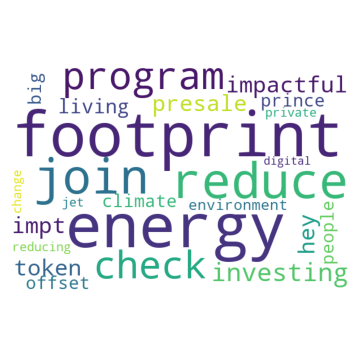

# Tweeting to NetZero

## Abstract
The clock is ticking to reduce greenhouse gas emissions in order to stave off the worst outcomes of climate change. With expectations of greater regulations and costs for emitting GHGs, companies worldwide are under pressure to set “net zero” target dates and are scrambling to minimize their GHG emissions to achieve these goals in the coming decades. Net zero is loosely defined maintaining a balance of no emissions, thereby either reducing or compensating for any GHG emissions released into the atmosphere. As carbon dioxide is a main contributor to GHG and global warming, emissions are generally estimated in carbon equivalents. For those companies that cannot remove all GHG from their operations, the voluntary carbon market allows carbon emissions from polluting companies to be “offset” by funding projects that reduce or remove an equivalent quantity of carbon from the atmosphere elsewhere through other means (e.g., reforestation, proper waste disposal, carbon capture). However, the majority of current transactions for the sale and purchase of these carbon offsetting projects is “over-the-counter.” This is inefficient, costly, and unreliable for a market that’s exploded to more than $1 billion in value. 
As thousands of companies are now searching for offsetting projects, new platforms (such as Salesforce's "Net Zero Marketplace") are seizing the opportunity to launch e-commerce marketplaces to connect buyers directly with sellers of environmental projects that have issued the bespoke carbon credits. These marketplace platforms must find the best market stragegies to appeal to buyers and attract project-owners to support their e-commerce ecosystem. With the multiple social media modalities at their disposal, a general understanding on current sentiments towards the carbon market and “net zero” may be beneficial. For example, identifying major discussion topics from recent Twitter posts in this vertical and clusters of the most prominent overarching thematic traits. By conducting this analyses of recent tweets, marketing teams will be armed with an understanding of how to best engage with positive content and deflect negative content at the very outset of product launches. 

## Design
Twitter data was obtained using the Twitter API v2 and the Tweepy python library. Search terms were queried as follows:

Query 1
(carbon credits) OR (carbon credit) OR (carbon market) OR (carbon markets) OR (carbon trading) OR (carbon trade) OR (carbon offset) OR (carbon offsets) OR #carboncredit OR #carboncredits OR #carbonmarket OR #carbonmarkets OR #carbontrade OR #carbontrading OR #carbonoffset OR #carbonoffsets

Query 2
(net zero) OR #netzero

Query 3
(carbon neutral) OR #carbonneutral

Query 4
(carbon footprint) OR #carbonfootprint

The recent_search_tweets Twitter API v2 Endpoint was used to capture the tweet and other metrics of interest. Each individual tweet is a separate unit of analysis (i.e., document) for this project, with the full corpus being all tweets within the queries for a lookback period of 21 days. Data was pulled from the API for 3 weeks to achieve a total of 21 days of Twitter activity on these topics.
 
## Data
Over 82,000 tweets were acquired over the course of three weeks. The tweets, timestamp, author ID, tweet ID, were obtained along with metrics on retweets, likes, replies and quoted data for each tweet. As retweets and non-English language tweets could not be removed during the API pull, these two initial steps were completed upon retrieving the tweets. The greatest proportion of resulting tweets were from the net zero query, followed by the carbon market/credit query, carbon footprint query, and lastly the carbon neutral query. The number of tweets acquired each week with each query were roughly consistent, and the resulting findings were generally additive to the initial findings in the first week. The corpus of tweets had up to more than 20,000 likes, though with a majority (>75%) of tweets having 0 likes. The most popular (i.e., liked/retweeted) tweets were those by validated accounts of American politicians or British figure heads or an Australian climate denialist. 

## Algorithms
### Preprocessing
Texts were cleaned using regularized expressions to remove hashtags, mentions, linebreaks, urls, upper cases and punctuation. Text was then tokenized to singular unigrams and were counted or converted to TF-IDF in matrices.
### Topic Modeling
Topic modeling using LSA was conducted on the resulting matrices as well as K-means and CorEx. Spacy was used for relevant named entity recognition that may not have been thoroughly captured by the alternative topic modeling methods. 

The LSA produced the following topics (with K-means and CorEx generally validating with similar topic compositions):
#### General Keyterm Quality Control topics &emsp;&emsp;&emsp;&emsp;&emsp;&emsp;&emsp;&emsp;&emsp; UK Politics topics
&emsp;&emsp;&emsp;&emsp;

#### Tokenizing (ie., Cryptos) Carbon Credits topics &emsp;&emsp;&emsp;&emsp;&emsp;&emsp;Renewable Energy
&emsp;&emsp;&emsp;&emsp;

### Sentiment Analysis
Sentiment analysis models included text with punctuation/upper cases but excluded urls, hashtags, mentions and linebreaks. Tweets were assigned with sentiment compound scores and overall sentiment labels (positive, neutral, or negative), accordingly.  The majority of tweets were labeled as either neutral (0.0 compound score) or positive (>0.0 compound score). The observed subjectivity vs. polarity of tweets confirmed this finding, with tweets trending towards lower subjectivity overall, and positive polarity as subjectivity increased.  

### Topic Modeling vs. Sentiment Analysis
Tweets were binned into primary topic categories based on their highest LSA value for each topic. These primary topics categories were plotted against the labeled sentiment to determine which topics had overall positive versus negative (or neutral) tweets. In general, the topics referring to UK politics had a greater proportion of negative tweets as compared to topics broadly on the carbon market, renewable energy sources, or tokenized carbon credits issued on the blockchain. 

Overall, recommendations for social media campaigns on carbon marketplaces are to emphasize language surrounding topics with a more seemingly positive slant, while minimizing mention of European (particularly UK) activities around Net Zero. Marketplace strategists may consider experimentally migrating some carbon credits to the blockchain or integrating crypto carbon credits into their marketplace, as there is great enthusiasm on Twitter around tokenization of carbon credits. Conversely, it would be wise not to campaign around convenings or events with world leaders (i.e., World Cup, United Nations Climate Change Conference Conference, World Economic Forum) as these tweets were found to have relatively negative sentiment scores. 

## Conclusion
- Could be challenging to launch the Net Zero Marketplace Platform in UK 
- Engagement with moving carbon credits accounting to blockchain (i.e., tokenization) may be advantageous 
- Heed caution for particularly controversial topics (i.e., World Economic Forum climate discussion, Net Zero at World Cup, upcoming COP27)

## Tools
- Data Collection - Tweepy library
- Preprocessing Tweets - re, nltk, langdetect libraries
- Data Manipulation - numpy and pandas libraries
- Tokenizing - CountVectorizer and TFIDFVectorizer from sklearn
- Topic Modeling - TruncatedSVD, KMeans from sklearn library,
			 CorExTopics and Spacy libraries
- Sentiment Analysis - Vader and TextBlob, ScatterText libraries
- Data Visualization - Matplotlib, plotly and Seaborn libraries

